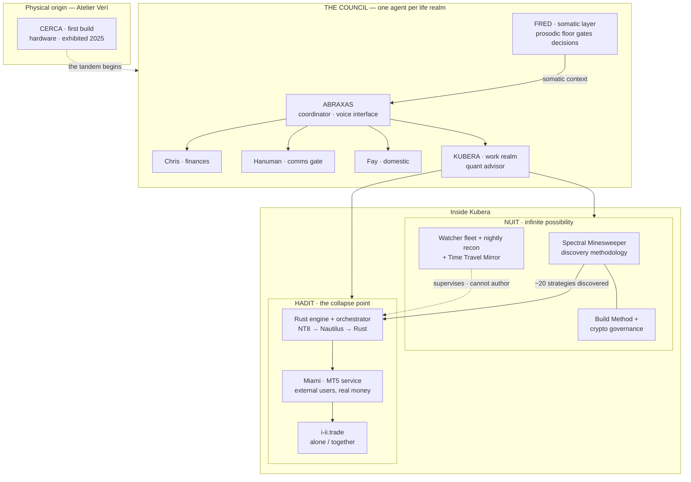

# The Story

Leo and Mariele Verí began building seriously with AI in 2025. The work grew into three connected trees with a physical root — and every piece exists because a real need in the previous piece demanded it.

**CERCA came first** — a physical build: Arduino, soldered electronics, custom-made conductive headphones, a Faraday-reference floor. An instrument that turns four people's touch into music and light. AI-assisted, hands-on. A provisional patent was filed (later lapsed). It proved the working tandem: operator + AI, powering real hardware.

**Then the Council.** Life divided into realms — finances, communication, domestic operations, work — each with a dedicated agent, all coordinated by **Abraxas**, the one agent the family actually talks to, by voice. Above them all stands **the Pillar** — five family principles, written as a constitution, that every agent advises through (serve the body first; the family eats first; words must match reality; every circle closes; sense is made together). Advice is the ceiling: agents inform, humans decide. Not every realm has its agent yet, and this repo says so plainly. Built today: **Chris** (finances — voice-note an expense, it lands in the ledger), **Hanuman** (the comms gate every agent routes through), **Fay** (domestic coordination in Haitian Creole), and **Fred** — the somatic layer. The family interacts by voice, so Fred measures the voice itself: deterministic prosodic measurements from longitudinal recordings, and decisions can be gated on whether the speaker is at their **prosodic floor** — their baseline. Somatic context no text model has.

**Kubera is the work realm's agent.** Inside that realm, the work splits in two, named for a duality: **NUIT**, infinite possibility, and **HADIT**, the point where possibility collapses into action.

**NUIT** began as a discovery system — a rigorous pipeline for finding trading edges in latent space. The pipeline generalized: it became a domain-agnostic discovery discipline, **Spectral Minesweeper**, with trading as its proving ground (chosen deliberately: manifestations are manufacturable, outcomes are cheap, and failures cost money, not people). Two things were *born inside* NUIT because the build demanded them: the **cryptographic Build Method** (the validation pipeline was built with AI agents, so heuristic drift had to be made structurally impossible — sealed handoffs, hash chains, halt gates), and **supervision** — once strategies went live, the circle closed: the system the strategies emerged from became their watcher, with an independent watcher fleet, nightly reconciliation, and the **Time Travel Mirror**, a byte-identical mirror of the live engine where every deploy is rehearsed before it touches money.

**HADIT** is the deployment layer. NUIT found ~20 strategies trading different hours and weekdays, so HADIT became a scheduler-orchestrator: regime awareness turns strategies on and off, sizing flexes with margin. Its lineage runs NT8 + C# DLL on a Windows box (Chicago) → Python/Nautilus → the **Rust engine** running today. And it grew outward: the cockpit became a service (**Miami** — connect a broker, run multiple accounts, copy-trade; external users trade real money on it today), and watching those users chart in one app, screenshot into another, and trade in a third produced the product: **i-ii.trade** — one place to trade, draw, drop voice notes on the chart, share with friends ("together"), or run your own strategy scheduler ("alone"), the same orchestration the family runs live.

**Hygiene is architecture.** HADIT lives on one server, NUIT on another. Discovery and supervision are deliberately separated from execution: the watcher cannot author what it watches.

**The umbrella.** The emerging shape above the trees: **Los Verí** (the family, the living research) → ventures **Altamar** (finance: NUIT + HADIT), **Atelier Verí** (art: CERCA and the portfolio — including **Chichigua**, a kite instrument that has actually flown), and **Anima** — the AI platform all the agents live inside, the way products live inside a company. Anima as a running platform is a stated aspiration, not a claim.

Every arrow exists because a real operational need forced it. The governance came from building with AI agents at scale; the watchers came from real money going live; the mirror came from refusing to deploy unrehearsed; the product came from watching real users struggle. The claim is not "we built a lot." It is: **we architect and build systems, supervising AI safely and verifiably — the way we've done for our own family, friends, and money.**
