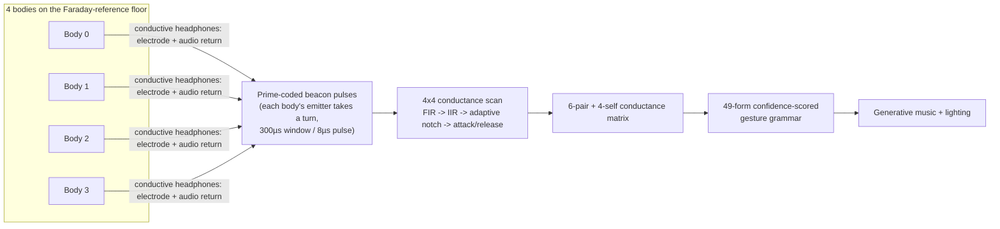
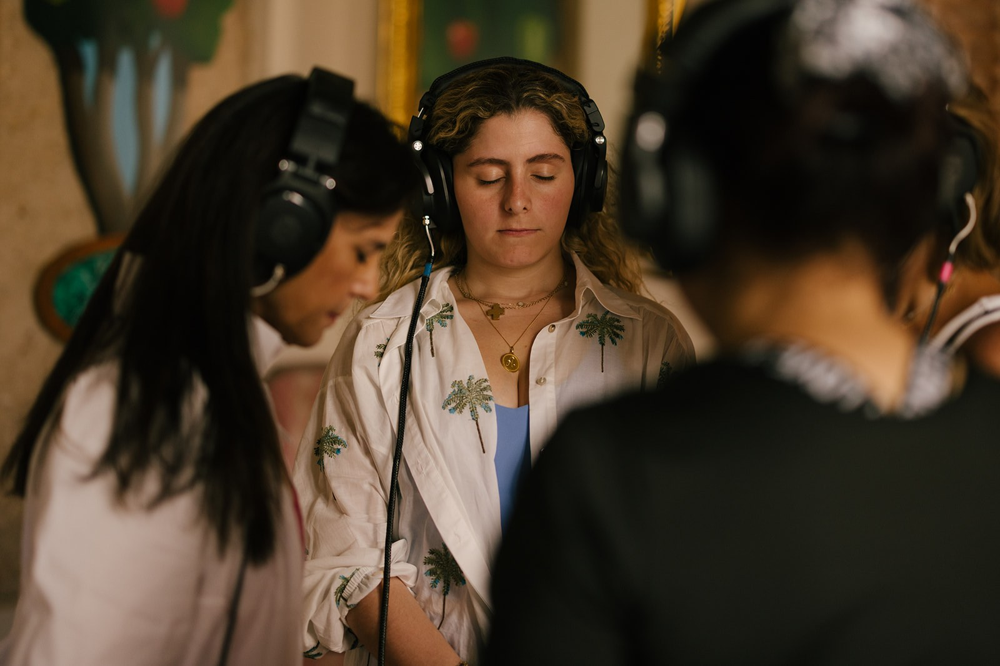

# CERCA

**Status: BUILT+EXHIBITED**
**Part of:** Atelier Verí — see [../../STORY.md](../../STORY.md)

CERCA is a four-body bioelectric touch instrument. Four people stand on a
conductive floor and hold or wear conductive headphones; the instrument
reads the conductance between every pair of bodies — and each body against
itself — and turns that live map of touch into generative music and light.
Exhibited at the **Kimpton Las Mercedes (2025)**; still iterated on since
(the firmware on disk runs to `CercaV7.0`, dated 2025-05-17, with earlier
`v6.x` and companion sketches — `Beacon`, `BeaconII`, `CercaCapIIR` —
sitting alongside it, evidence of a real build history, not a one-off).

## What it is, physically

Soldered electronics: an Arduino driving 4 analog sensing pins and 4
digital beacon-emitter pins, one pair per participant. Custom-made
conductive headphones serve double duty — electrode contact **and** audio
return — so the audience never touches a separate sensor pad. The
performance floor is wired as a Faraday reference so the instrument reads
conductance *between bodies*, not noise from the room. Leo & Mariele Verí
built it; AI-assisted, hands-on.

## Signal chain

Each of the 4 emitters beacons in turn while all 4 channels listen — a
prime-number-coded pulse scheme disambiguates which pair is actually in
contact, rather than assuming only one pair touches at a time (see
[DECISIONS.md](DECISIONS.md)). That produces 6 unique pair-readings plus 4
self/diagonal readings — 10 channels total, matching the firmware header
comment ("Exactamente 10 columnas (6 pares + 4 canales)"). Those 10
channels are the input to a 49-form confidence-scored gesture grammar,
which drives the generative sound and light engine. Full detail:
[ARCHITECTURE.md](ARCHITECTURE.md).

## Photos, and the production scale behind them

*Two of 8 web-size photos on the operator's archive (2025-06-25 shoot);
selected as the two smallest files. See [EVIDENCE/README.md](EVIDENCE/README.md).*

These 8 web photos are the curated tip of a real production archive: **538 RAW photographs and
106 video clips (69GB)** from the same install shoot sit on the operator's archive drive — a
professional-scale documentation effort, not a phone-photo afterthought. Alongside the Arduino
firmware, a full **Cycling '74 Max/MSP + Ableton Bidule signal-routing rig** exists for the
piece's audio side (patches for binaural rendering, inter-process audio routing, a SuperCollider
communication test, a gesture test harness, and a verified MIDI environment) — CERCA's sound
engine is a real, iterated DSP rig, not a placeholder. Two sibling beacon-hardware sketches
(`Beacon`, `BeaconII`) and an in-progress JUCE-framework app build (`CercaJuce`) round out a
build that spans embedded firmware, live signal routing, and native app tooling. None of the RAW
photo/video/patch material is reproduced here (bulk binary media, not evidence text); the counts
above are cited as scale evidence, verified by direct directory listing.

## Patent story (stated exactly)

A provisional patent was filed; USPTO requested additional information;
the filing was allowed to lapse. No claim of "patented" or
"patent-pending" is made here or anywhere in this repo. The invention's
distinctive elements — prime-coded beacon pulses, conductive
headphones as dual electrode/audio-return, the Faraday-reference floor,
the 6-pair + 4-self conductance matrix, and the 49-form gesture grammar —
are described above from the operator's own record.

## Evidence

See [EVIDENCE/](EVIDENCE/) for photos and a firmware excerpt (index and
redaction notes in `EVIDENCE/README.md`), [ARCHITECTURE.md](ARCHITECTURE.md)
for the full signal chain, and [DECISIONS.md](DECISIONS.md) for the design
choices and what was rejected.
