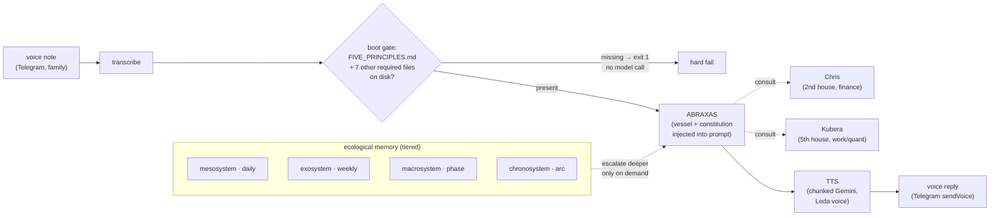

# Abraxas

**Status: RUNNING (daily)** — the voice-interfaced agent the family runs daily life through, in production since March 2026.

## What it is

Abraxas is the coordinator: the top of the Council (see [STORY.md](../../STORY.md)), the one agent the family actually talks to, by voice, rather than a chat window. A voice note in — over Telegram — becomes a transcript, a reasoning pass grounded in a required constitution and a tiered memory of the household, optional consultation with the domain agents (Chris for money, Kubera for work/quant, Fred for prosody), and a spoken reply back out. It is not a chatbot with a system prompt; it is a CLI-launched process (`tools/abraxas`) that refuses to run at all if its constitution file is missing from disk — see the boot gate below.

Abraxas sits at the Council's `meta_layer` — above the planning/execution pipeline (GARUDA, MUSHAKA) and above the domain agents it consults, never merging their work into itself. Nine agents (ABRAXAS, GARUDA, MUSHAKA, FRED, CHRIS, KUBERA, FAY, THOTH, SCRIBE) are registered with machine-readable contracts under this hierarchy; seven of them have working persona/constitution ("vessel") files on disk — direct evidence the twelve-house Council design is real and partially built, not aspirational (see `EVIDENCE/council_topology.md`).

## Enforcement, honestly

Abraxas hard-fails at boot if `FIVE_PRINCIPLES.md` — the operator's own written constitution — is missing from disk. That is real and verified in the source (`EVIDENCE/boot_hard_fail.md`). What that gate does **not** do is validate the model's output against those principles in code. The full principles text is read from disk and injected into the prompt, wrapped in delimiters, ahead of every turn — a prompt-injection convention the model is expected to honor, not a constraint the code checks or enforces after the fact. **This is not constitutional AI.** It is a hard-fail on the constitution's *presence*, plus a strong prompt convention for its *observance* — a meaningfully weaker guarantee, stated plainly rather than oversold.

## Architecture (short version)

- **CLI wrapper** (`tools/abraxas`, bash): resolves the constitution + memory-index files, hard-fails if any are missing, injects them into the prompt, then launches the model.
- **Launcher** (`gsd`, a Node CLI): the process the bash wrapper actually execs, carrying model/provider selection through to the API call.
- **Model**: Gemini 3.1 Pro (interactive/headless reasoning; `--model` override supported per call).
- **TTS**: a separate chunked pipeline (`abraxas_tts.py`) — not the reasoning model itself — renders replies through Gemini's TTS model, one voice per agent (Abraxas = Leda, en-GB; Kubera = Achernar, en-US).
- **Delivery**: a shared Telegram/WhatsApp send layer (`send_channel_agent_response.py`, under the comms gate — see [Hanuman](../hanuman/)) posts text via `sendMessage` and voice via `sendVoice`.
- **Memory**: six on-disk tiers (macro/chrono/exo/meso-system, semantic, procedural) modeled on Bronfenbrenner's ecological systems theory — see `EVIDENCE/memory_tiers.md`.

## What's proven, not asserted

- The boot hard-fail is real code, not a stated policy — verified in the source (`EVIDENCE/boot_hard_fail.md`, `SNIPPETS/boot_gate.sh`).
- Daily use, verified from disk: 9 archived Telegram text responses (5 with paired voice audio) spanning 2026-03-17 → 2026-04-21, plus a `launchd` job firing weekdays at 06:00 with 194 runtime artifacts logged since 2026-03-17 (`EVIDENCE/usage_archive.md`). Tool source files show continued revisions into July 2026.
- The Council topology (9 agent contracts, 7 vessel files, a declared routing table, an explicit hierarchy placing Abraxas above the domain agents it consults) is real and on disk, not documentation-only (`EVIDENCE/council_topology.md`).
- The tiered memory model is populated on disk, unevenly (12 daily meso-system entries vs. 2 weekly exo-system entries) — consistent with active, ongoing development (`EVIDENCE/memory_tiers.md`).

## Evidence index

| File | What it shows |
|---|---|
| [EVIDENCE/boot_hard_fail.md](EVIDENCE/boot_hard_fail.md) | The `require_file` boot gate, full context, from the actual CLI source |
| [EVIDENCE/usage_archive.md](EVIDENCE/usage_archive.md) | Response-archive counts/dates + the scheduled morning-brief `launchd` job |
| [EVIDENCE/council_topology.md](EVIDENCE/council_topology.md) | Vessel file listing, `agent_contracts.json` structure, the hierarchy block |
| [EVIDENCE/memory_tiers.md](EVIDENCE/memory_tiers.md) | The six ecological memory tiers, verified against the directory tree |

## Snippets

| File | What it shows |
|---|---|
| [SNIPPETS/boot_gate.sh](SNIPPETS/boot_gate.sh) | The constitution/memory-file boot gate, in full |
| [SNIPPETS/tts_chain.py](SNIPPETS/tts_chain.py) | The chunked Gemini TTS pipeline that renders voice replies |
| [SNIPPETS/agent_contract_shape.json](SNIPPETS/agent_contract_shape.json) | The full ABRAXAS contract entry — the shape shared by all 9 registered agents |

## Related

- [ARCHITECTURE.md](ARCHITECTURE.md) — components, the consultation pattern, memory tiers, the enforcement-honesty section in full.
- [DECISIONS.md](DECISIONS.md) — choices and rejected alternatives.
- [STORY.md](../../STORY.md) — where Abraxas sits above the Council.
- [Chris](../chris/), [Fred](../fred/), [Fay](../fay/), [Hanuman](../hanuman/) — the house agents and comms gate Abraxas consults through.

## Advising through the Pillar

Abraxas doesn't answer in a vacuum: every recommendation is framed through [the Pillar](../README.md#the-pillar) — the five family principles its boot gate requires on disk — and through consultation with the house-lords (money → Chris; work → Kubera). The contract language is explicit: agents give informed insights, observations, and appreciations; **verdicts belong to the operators**. That division — constitution above, specialist counsel beside, human decision at the end — is the Council's whole design.

**Adoption:** 194 scheduled morning-brief artifacts (weekday 6am job, running since 2026-03-17, still logging) plus an archive of voice replies; tooling revised as recently as July 2026. Formal usage instrumentation beyond artifact counts: not yet built — stated as a gap.
