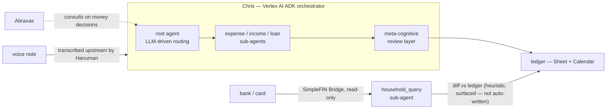

# Chris — 2nd House, Household Finance

**Status:** RUNNING on Vertex AI Agent Engine (ADK) · bank feed BUILT+WIRED · reconciliation DESIGNED, not built
**Part of:** the Council — see [STORY.md](../../STORY.md)

Chris is the household's finance operator. Say an expense out loud and it lands in the ledger — a spreadsheet-of-record and a shared calendar, not a spoken-into-a-form app. Chris is an ADK **orchestrator**, not a monolithic agent: an LLM-driven root routes each request to one of eleven specialized sub-agents (expense, income, loans, calendar, household query, viz, research, knowledge library, ...), and each sub-agent owns a narrow slice of intelligence — parsing an expense, computing a subscription schedule, answering "what's in the Life Tracker" — while persistence (Sheets, Calendar) is handled centrally.

A second, independent thread reads bank and card transactions directly: a SimpleFIN Bridge client is built and wired into a `household_query` sub-agent, so Chris can be asked "what hit my card this week that isn't logged yet" and get a real answer, heuristically diffed against the ledger. What is **not** built is the other half — automatic reconciliation: matching bank transactions to ledger entries with confidence, writing the match back, closing the loop without a human reading the diff. That half is designed, stated here plainly, not implied by the code that exists.

Every output Chris produces — a parsed transaction, a correction, an architectural instruction — passes through a **meta-cognitive review layer** before it's trusted: a second pass that classifies intent, scores confidence, and can trigger self-healing before anything is written.

For money decisions bigger than "log this expense," Chris is a source [Abraxas](../abraxas/) consults — the lord of lords delegates financial judgment to the specialist that owns the domain, the same pattern used across the Council.

## What's proven here

| Claim | Evidence |
|---|---|
| RUNNING on Vertex AI Agent Engine, ADK multi-agent orchestrator | [EVIDENCE/01-adk-orchestrator.md](EVIDENCE/01-adk-orchestrator.md) |
| Voice-note-to-ledger expense flow (intent classification → schedule → persistence) | [EVIDENCE/02-expense-flow.md](EVIDENCE/02-expense-flow.md), [SNIPPETS/expense_agent_excerpt.py](SNIPPETS/expense_agent_excerpt.py) |
| SimpleFIN bank feed BUILT+WIRED (client + household-query sub-agent, read-only) | [EVIDENCE/03-simplefin-built-wired.md](EVIDENCE/03-simplefin-built-wired.md), [SNIPPETS/simplefin_client_excerpt.py](SNIPPETS/simplefin_client_excerpt.py) |
| Meta-cognitive review layer (agent reviews its own output before it's trusted) | [EVIDENCE/04-meta-cognitive-layer.md](EVIDENCE/04-meta-cognitive-layer.md) |
| Reconciliation stated DESIGNED, not built | [ARCHITECTURE.md](ARCHITECTURE.md#reconciliation-the-designed-half) |

See [ARCHITECTURE.md](ARCHITECTURE.md) for the full system shape and [DECISIONS.md](DECISIONS.md) for what was rejected and why.

*Redactions: no financial data, balances, budgets, account names/numbers, bank names, SimpleFIN tokens or URLs, GCP project IDs, Vertex resource names, or family personal content appear anywhere in this directory. See each evidence file's header for what was redacted from that specific artifact.*
