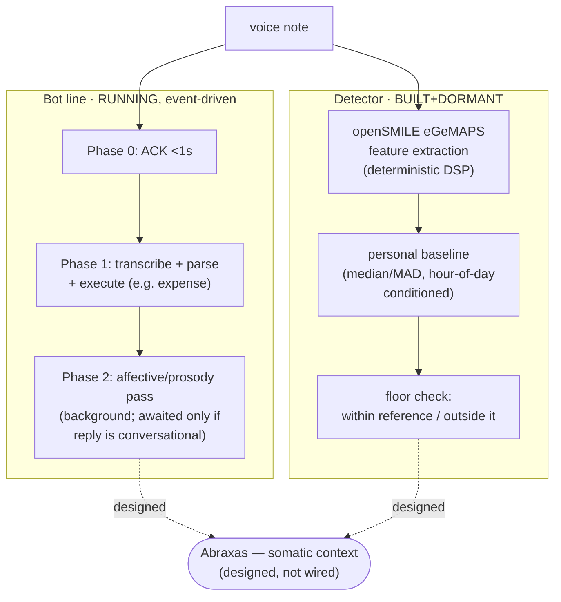

# Fred

**Part of:** the Council — see [STORY.md](../../STORY.md)

| System | Status |
|---|---|
| **Bot** — Telegram voice-note assistant (v6.3.8, Hume-era lineage → later Gemini migration) | **RUNNING** (event-driven; watcher log fires through 2026-08-24, local poller log active through 2026-08-30) |
| **Detector** — deterministic openSMILE/eGeMAPS vocal-dysregulation pipeline | **BUILT+DORMANT** (validated 2026-04-10; scoring untouched since) |

Fred is the somatic layer: the agent that measures the voice itself, because the family interacts by
voice and no text model captures what's in how something is said. Fred is **two systems, stated as
two, with different current liveness — that difference is reported precisely, not smoothed over**.
The first is a voice-note Telegram bot — transcribe, respond, execute the fast stuff (like an
expense) before the slow, affective reply — running today as four always-on launchd jobs on the
household Mac, including a `WatchPaths` agent wired directly into the real macOS Voice Memos
recordings folder. The second is a deterministic prosody pipeline: extract openSMILE/eGeMAPS acoustic
features from a voice note, compare them against *that person's own* longitudinal baseline,
conditioned on time of day, and check whether the current note falls outside their personal
acoustic floor. Built, validated once against an independent real-world signal, and deliberately
left dormant since. The two systems share a migration story — the first ran on a hosted affect API
appropriate for population-relative scoring; the moment the question changed to "is *this person*
at *their own* baseline," the stack had to change with it, because a hosted probabilistic model
cannot anchor a within-person reference. That forced move, Hume → openSMILE, is the whole reason
these are two systems rather than one continuously-upgraded one.

## What's proven here

| Claim | Evidence |
|---|---|
| Bot is real, v6.3.8, two-phase progressive-response design (verbatim header + timing constants) | [`EVIDENCE/bot_v6_3_8_header_and_two_phase_design.md`](EVIDENCE/bot_v6_3_8_header_and_two_phase_design.md) |
| Migration trail (dated backup snapshots, five months of model swaps) + Cloud Run hosting, both systems | [`EVIDENCE/migration_trail_and_cloud_hosting.md`](EVIDENCE/migration_trail_and_cloud_hosting.md) |
| Bot line is running: 4 launchd jobs, `WatchPaths` on the real Voice Memos folder, watcher log through 2026-08-24, local poller log through 2026-08-30 | [`EVIDENCE/launchd_automation_and_live_activity.md`](EVIDENCE/launchd_automation_and_live_activity.md) |
| Prosody corpus: 391 real `prosody_summary.json` files, dual-layer schema (named-emotion + peak-moments, plus a windowed acoustic layer) | [`EVIDENCE/prosody_corpus_schema_and_scale.md`](EVIDENCE/prosody_corpus_schema_and_scale.md) |
| Detector's feature extraction is deterministic openSMILE/eGeMAPS; baseline is within-person, hour-of-day conditioned, robust-statistics | [`EVIDENCE/detector_feature_extraction_and_baseline_design.md`](EVIDENCE/detector_feature_extraction_and_baseline_design.md) |
| Study 1 design: frozen in-sample reference, chronological OOS, six pre-declared stress tests | [`EVIDENCE/study1_design_excerpt.md`](EVIDENCE/study1_design_excerpt.md) |
| The 2026-04-10 validation event — what it shows and what it doesn't | [`EVIDENCE/validation_event_summary.md`](EVIDENCE/validation_event_summary.md) |
| Real code excerpts: two-phase bot header, feature-extraction + baseline shape | [`SNIPPETS/`](SNIPPETS/) |
| Full mechanism, both systems, hosting, running-vs-dormant | [`ARCHITECTURE.md`](ARCHITECTURE.md) |
| Decisions + rejected alternatives | [`DECISIONS.md`](DECISIONS.md) |

## What this is not

No audio, no personal feature values, thresholds, or baselines, and no clinical claims appear
anywhere in this directory. The detector's ceiling is **"dysregulation detection relative to a
personal baseline"** — never a diagnosis, never medical language, and the detector's own design
document goes out of its way to avoid the clinical term for exactly that reason (see
[`EVIDENCE/study1_design_excerpt.md`](EVIDENCE/study1_design_excerpt.md)). Leo and Mariele are
named here only as the operators/subjects-by-choice, in the abstract — one trained on longitudinal
voice notes, the other currently on population benchmarks — with no values attached to either name
anywhere in this repo.
