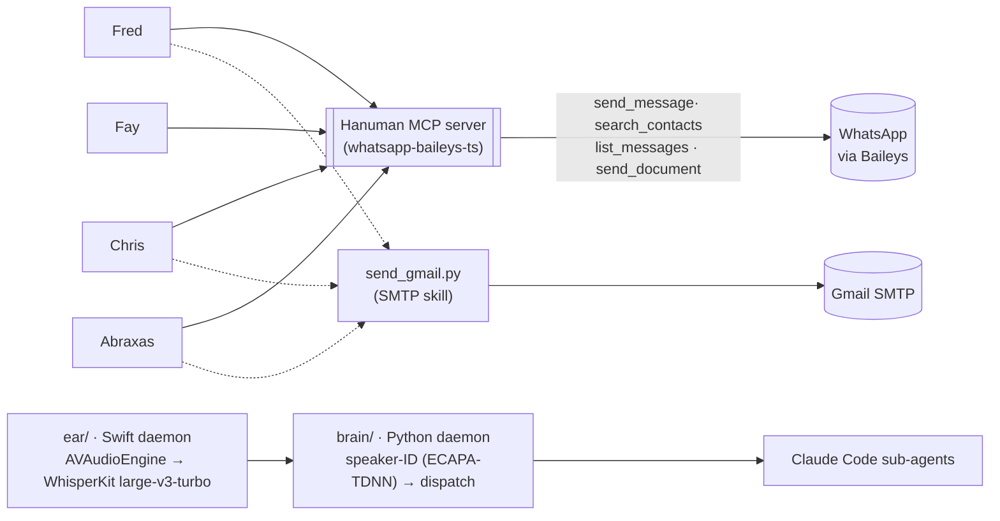

# Hanuman

**Status: RUNNING** — the 3rd-house comms gate: one MCP server every agent's WhatsApp and Gmail calls route through, plus a local, on-device voice-transcription pipeline built in Swift/CoreML.

## What it is

Hanuman does not own a house's domain — it owns how any house *talks*. Every agent that needs to send a WhatsApp message or an email calls the same tool surface; Hanuman is the only thing that holds a WhatsApp session or an SMTP credential. See [Fay](../fay/) for the clearest example of a consumer: Fay decides *what* to tell the household staff, translates it, and hands the actual delivery to Hanuman.

Separately, Hanuman runs a local voice-transcription daemon (`ear/`, Swift + WhisperKit on the Neural Engine) — real-time speech-to-text plus per-speaker identification, feeding a Python "brain" that dispatches to Claude Code sub-agents. This is infrastructure for spoken interaction with the Council, independent of the messaging gate.

## The boundary: protocols, not content

Hanuman moves messages; it does not decide what they say or who they're for. `whatsapp-mcp`'s tool surface takes a JID and a text string — it has no model of "household staff" or "family finances." That knowledge lives in the calling agent (Fay, Chris, ...). This is why the SKILL.md for the WhatsApp bridge says explicitly: don't build a second transport, don't route around Hanuman with browser automation — use the one gate. See `DECISIONS.md`.

## What's proven, not asserted

- A real MCP tool surface: `search_contacts`, `list_messages`, `list_chats`, `get_chat`, `get_message_context`, `send_message`, `send_document`, `search_messages` — 8 tools, defined with Zod schemas, exercised by a maintained TypeScript codebase (`whatsapp-mcp/src/mcp.ts`, active commit history).
- Two independent MCP-consumer skill docs (`skills/send-whatsapp-via-hanuman/SKILL.md`, `whatsapp-mcp/SKILL.md`) that both name Hanuman's repo as the canonical path and explicitly forbid alternate transports.
- The `ear/` Swift package depends on and instantiates `WhisperKit` at the `large-v3-turbo` model — confirmed in `Package.swift` and `main.swift`, not just described in prose.
- A working, separate speaker-identification pipeline (`brain/speaker_id.py`, ECAPA-TDNN via speechbrain) with real enrolled voice samples on disk (`enrollment/operator_a.wav`, `enrollment/operator_b.wav`, `enrollment/embeddings.json`) and real session transcript logs.
- `config/hanuman.yaml` declares CoreAudio AEC (`system_aec: true`) and speaker-embedding-based echo exclusion as the intended echo-cancellation design — see `EVIDENCE/voice_pipeline_components.md` for exactly what's config vs. what's implemented in the current build.

## Evidence index

| File | What it shows |
|---|---|
| [EVIDENCE/mcp_tool_surface.md](EVIDENCE/mcp_tool_surface.md) | The 8-tool MCP surface, listed from source, with the `send_message` schema in full |
| [EVIDENCE/voice_pipeline_components.md](EVIDENCE/voice_pipeline_components.md) | On-disk verification of the voice pipeline: WhisperKit large-v3-turbo confirmed, VAD as actually implemented, AEC as configured, speaker-ID as a separate ECAPA-TDNN pipeline |
| [EVIDENCE/whatsapp_mcp_git_log.md](EVIDENCE/whatsapp_mcp_git_log.md) | Recent commit history on the WhatsApp bridge — active maintenance, not a one-off script |
| [EVIDENCE/skill_docs_consumer_contract.md](EVIDENCE/skill_docs_consumer_contract.md) | Two independent skill docs instructing agents to use the one gate, never a second transport |

## Snippets

| File | What it shows |
|---|---|
| [SNIPPETS/send_message_tool.ts](SNIPPETS/send_message_tool.ts) | The `send_message` MCP tool — JID in, text in, WhatsApp message out. No domain knowledge inside it. |
| [SNIPPETS/vad_and_hallucination_gate.swift](SNIPPETS/vad_and_hallucination_gate.swift) | The real-time energy gate and Whisper-hallucination filter that sit between the mic and a transcript |

## Related

- [ARCHITECTURE.md](ARCHITECTURE.md) — the MCP gate model and the voice pipeline, in more detail.
- [DECISIONS.md](DECISIONS.md) — choices and rejected alternatives.
- [Fay](../fay/) — the clearest consumer: decides content and language, hands delivery to Hanuman.
- [STORY.md](../../STORY.md) · [council/README.md](../README.md)
