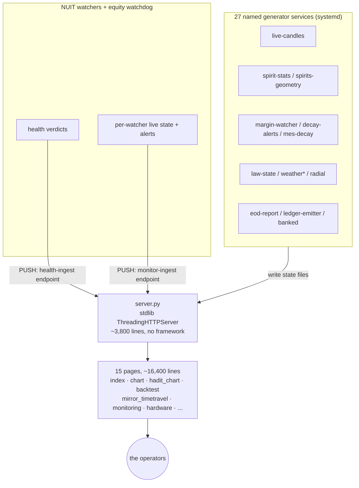

# HADIT Cockpit

**Status: RUNNING**
**Part of:** HADIT — see [STORY.md](../../../STORY.md)

The family's own web trading cockpit — a real, standalone application, not a thin wrapper around the engine. **~34,000 lines**: a 3,803-line Python backend (stdlib `ThreadingHTTPServer`, no framework) serving 15 real front-end pages (~16,400 lines of HTML/JS across `index.html`, two independent live-chart pages, a backtest view, a mirror/time-travel view, a hardware/health view, and more), fed by **27 named, independently-scheduled data generators** (`live-candles`, `spirit-stats`, `spirits-geometry`, `margin-watcher`, `decay-alerts`, `decay-state`, `mes-decay`, `law-state`, `radial`, `weather`/`weather-arm`/`weather-terroir`, `eod-report`, `ledger-emitter`, `witness-rollup`, `witness-edp-backfill`, `readiness`, `positions`, `banked`, `dayleg-cap`, `thoughtbubble`, `bartender`, `alarms`/`alarm-watcher`, `gold-weather`, `deck-health`, `deck-descriptor`, `edges-live`, `check-narration`, `recon-daily`) — 38 of the [engine](../engine/)'s 47 automation units exist specifically to feed this cockpit.

This is the operational surface the family actually watches: 25 strategy legs with toggles, a weekly scheduler, a live MES chart with real candles and tick tape, a regime sit-out banner, decay/margin monitoring, and a manual-trading panel — the same panel design later ported outward to [Miami](../miami/) and translated for [the family's own futures venue](../miami/EVIDENCE/cross_pollination_family_cockpit.md).

## What runs today

- **Live market data**: real MES candles + tick tape, updated continuously, not polled-on-load.
- **Strategy monitoring**: per-leg cards for the live roster, decay alerts, margin watching, a "banked" ledger view, day-leg risk caps.
- **Regime awareness surfaced to a human**: a sit-out banner that names *why* a session is held out (a specific regime condition), not just a binary on/off.
- **A health ingest, not just a display**: the [NUIT watchers](../../nuit/watchers/) and equity watchdog *push* their verdicts into this cockpit over a dedicated ingest endpoint — the Monitoring tab is fed by the same processes documented in the watchers project, not a separate re-implementation. See `EVIDENCE/health_and_monitor_ingest.md`.
- **Explicit non-order-path annotations in the source itself**: routes that only display data are commented and operator-signed as such — a real, in-code discipline for keeping the money path and the display path visibly separate (see `SNIPPETS/`).
- **Deploy-rehearsal awareness**: a dedicated Time Travel / mirror-runs view, surfacing the [Time Travel Mirror](../../nuit/time-travel-mirror/)'s state directly in the operational UI.

## Architecture

## Evidence index

| Claim | File |
|---|---|
| Real backend/frontend line counts, per-file breakdown | `EVIDENCE/scale_and_page_inventory.md` |
| 27 named generator services, what each feeds | `EVIDENCE/generator_fleet.md` |
| Watchers/watchdog PUSH into the cockpit via a dedicated ingest endpoint | `EVIDENCE/health_and_monitor_ingest.md`, `SNIPPETS/health_ingest_handler.py` |
| In-source money-path / display-only annotation discipline | `SNIPPETS/health_ingest_handler.py` |
| Decisions + rejected alternatives | `DECISIONS.md` |
| Components, data flow, boundaries | `ARCHITECTURE.md` |

*No screenshots are included (this archive was built without interactive browser access to the
live cockpit); evidence here is source- and log-derived, not visual. Hostnames, account data,
strategy parameters, and P&L are redacted throughout, per this repo's standing policy.*
