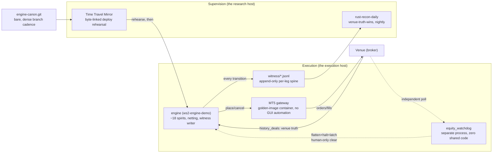

# HADIT engine

**Part of HADIT — see [STORY.md](../../../STORY.md).**

The Rust execution engine that trades real money: order routing and a strategy roster of ~18 legs
("spirits"), an append-only witness log of every order-lifecycle decision, an independent equity
watchdog that can flatten and halt the account without the engine's cooperation, nightly
canon-vs-live reconciliation, and a bare-repo deploy discipline rehearsed in a byte-linked mirror
before anything reaches the live binary. It exists because the earlier NT8 and Python/Nautilus
stages (see [LINEAGE.md](../../../LINEAGE.md)) proved the strategies but not the operational
discipline required to run them unattended with real capital — this engine is that discipline,
built into the runtime.

## Status

| Component | Status | Evidence |
|---|---|---|
| Engine (`ws2-engine-demo.service`) | **RUNNING** (real money) | `EVIDENCE/01_engine_status_and_loc.md` |
| Equity watchdog (`equity-watchdog.service`) | **RUNNING**, independent process | `EVIDENCE/03_equity_watchdog_design.md` |
| Nightly reconciliation (`rust-recon-daily.timer`) | **RUNNING**, 22:12 UTC | `EVIDENCE/05_nightly_recon_digest.md` |
| Byte-parity certification | **BUILT**, exercised per deploy branch | `EVIDENCE/02_byte_parity_certification.md` |
| MT5 gateway (golden-image container) | **RUNNING** | `EVIDENCE/07_mt5_gateway_golden_image.md` |
| Deploy/rollback discipline | **BUILT**, exercised (dense branch cadence) | `EVIDENCE/06_deploy_discipline_canon.md` |

## Architecture

## What runs today

- Live order routing across ~18 strategy legs, on the venue's actual fills, not simulated ones.
- An append-only witness event for every order-lifecycle transition (`ORDER_PLACED`,
  `ORDER_BLOCKED`, `CANCELLED`, `FILLED`, `EXIT`, `SIT_OUT`), partitioned per leg per trading day.
- An equity watchdog polling the same venue truth as the engine, independently able to flatten,
  halt, and latch the account — clearable only by a human.
- Nightly reconciliation of canon (what should have traded) against live (what did), stating
  plainly in its digest when a matched trade could not be priced rather than folding it into a
  total.
- A `check` smoke-test path that boots the real deck, real warmup spine, and pings every account
  lane's identity before any run — and reports whether live trading is actually armed.
- A dense, near-daily deploy-branch cadence into a bare canon repo, each branch rehearsed in a
  byte-linked mirror before a flat-window swap with a pre-written rollback marker.

## Evidence index

| Claim | File |
|---|---|
| Engine LOC / crate map, live systemd status | `EVIDENCE/01_engine_status_and_loc.md` |
| The wider verification surface: an 11-crate harness fleet checking live canon consistency, and the real automation-unit count (47) behind it | `EVIDENCE/09_verification_harness_fleet_and_automation_scale.md` |
| Byte-parity certification methodology + a real honest red, root-caused | `EVIDENCE/02_byte_parity_certification.md` |
| Independent equity watchdog design (flatten/halt/latch, human-only clear) | `EVIDENCE/03_equity_watchdog_design.md` |
| Append-only witness JSONL sample (redacted) | `EVIDENCE/04_witness_spine_sample.md` |
| Nightly reconciliation, venue-truth-wins, explicit unpriced-row digest | `EVIDENCE/05_nightly_recon_digest.md` |
| Bare-canon deploy cadence + redacted rollback marker | `EVIDENCE/06_deploy_discipline_canon.md` |
| MT5 gateway: declarative golden-image boot, no GUI automation | `EVIDENCE/07_mt5_gateway_golden_image.md` |
| `check` smoke-test output shape + dry-run-by-default | `EVIDENCE/08_ws2_check_dry_run.md` |
| Venue-truth exit gate (`exit_is_solo_and_flat`) | `SNIPPETS/venue_truth_gate.rs` |
| Fail-open-to-null enrichment pattern | `SNIPPETS/fail_open_to_null.rs` |
| Witness append call, loud-failure design | `SNIPPETS/witness_append.rs` |
| Fail-closed lane identity check | `SNIPPETS/lane_identity_fail_closed.rs` |
| Decisions + nearest-wrong alternatives rejected | `DECISIONS.md` |
| Components, data flow, boundaries, failure modes, human gates | `ARCHITECTURE.md` |

The 2026-07-08 certification sweep record was located on the execution host
(`CERT_SUITE_GREEN_SWEEP_20260708_HANDOFF.md`): **26/28 green, 2 genuine divergences —
"STOP+report per mandate, not forced"** — with both reds precisely characterized and one leg
recorded as "no cert harness exists (precisely, not fabricated)." Redacted excerpt in
`EVIDENCE/02`, alongside real harness output and a second honest-red example from a 2026-08-10
independent audit.

---
*A note on the service name: the live engine runs under a systemd unit whose name ends in `-demo` — a historical artifact from its cautious first deployment that was never renamed (renaming a live-money unit is deferred to a flat maintenance window, deliberately). The unit's own description string says what it is. We flag it here because label-equals-substance cuts both ways.*
