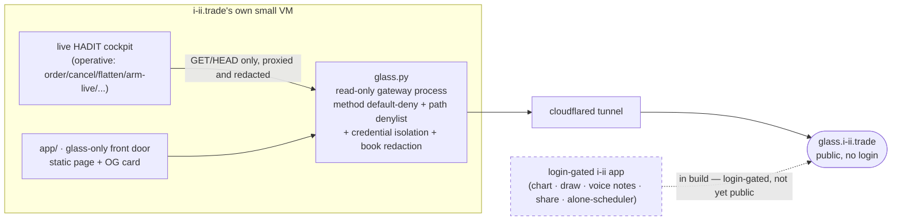

# i-ii.trade

**Status: RUNNING (early product)**
**Part of HADIT — see [STORY.md](../../../STORY.md).**

The origin is concrete, not abstract: watching real Miami users (see
[`../miami/`](../miami/)) chart in one app, screenshot the chart into a second app, and place
the trade in a third — three tools stitched together by hand for something that is really one
motion. **i-ii.trade** is that motion made into one place: **"together"** — chart, draw, drop
voice notes on the chart, share with friends, trade, all in one surface — or **"alone"** — run
your own strategy scheduler on the same orchestration engine the family trades live
(see [`../engine/`](../engine/)). The name is the split: **i** and **ii**, alone and together, one
mark.

This directory keeps the two kinds of claim visibly apart, on purpose:

- **What is running today** — a real public surface, `glass.i-ii.trade`, a strictly read-only
  gateway onto the live HADIT cockpit, with privilege separation enforced in server code, not
  hidden buttons.
- **What is in build** — the login-gated "alone/together" app itself runs on the same VM
  (operator-attested; it was not independently inspected for this archive, so its feature
  completeness is deliberately left unclaimed). The product vision is evidenced by the freshest
  founder-voice artifact (an investor-pitch rewrite, Aug 27 2026). Nothing here claims a feature
  exists that isn't evidenced.

## Architecture (what's actually live)

`glass.i-ii.trade` is the one public URL evidenced as running: a login-free, write-free window
onto the real cockpit. The login-gated product app (the "together"/"alone" experience described
below) is under active iteration on the same small VM but is not the artifact being proven here —
see [ARCHITECTURE.md](ARCHITECTURE.md) for the boundary between the two.

## The concept — honestly staged

| Piece | What it is | Status | Evidence |
|---|---|---|---|
| Public read-only glass | Anyone can watch the live multi-account cockpit work — spirits, schedules, order lifecycle — with money/account identity stripped and every write path refused server-side | **RUNNING** | `EVIDENCE/01_glass_privilege_separation.md`, `EVIDENCE/02_blocked_log_enforcement.md` |
| "Together" — social charting | Draw on a chart, drop a voice note on it, share with friends, trade from the same view | **IN BUILD** (login-gated app runs, operator-attested; feature completeness not independently verified) | `EVIDENCE/03_product_vision_pitch_excerpts.md` |
| "Alone" — your own scheduler | Run your own strategies on the same regime-aware orchestration the family trades live (see `../engine/`) | **IN BUILD** (same basis) | `EVIDENCE/03_product_vision_pitch_excerpts.md` |
| Brand | A relational glyph mark — "i" and "ii" as one figure | **BUILT** (design asset) | `EVIDENCE/04_glyph_brand_mark.svg` |
| Active development | Nine `glass.py` iterations in under two and a half hours on 2026-08-30, still moving as of the day before this snapshot | **evidenced** | `EVIDENCE/02_blocked_log_enforcement.md` |

## Lineage

`../nt8-chicago/` → `../engine/` → `../miami/` (external users, real broker accounts, real money)
→ **i-ii.trade**. Each arrow in [STORY.md](../../../STORY.md) exists because a real operational
need forced it; this one is the most recent: Miami's own users doing by hand, across three apps,
what should have been one product.

## Evidence index

1. `EVIDENCE/01_glass_privilege_separation.md` — `glass.py` design excerpt: method default-deny,
   endpoint-exact path denylist, credential isolation, no protocol upgrades, server-side book
   redaction.
2. `EVIDENCE/02_blocked_log_enforcement.md` — `blocked.log` line count and a redacted tail
   (refused writes actually observed in the log), plus the `.bak` iteration timestamps as
   active-development evidence.
3. `EVIDENCE/03_product_vision_pitch_excerpts.md` — short excerpts from a founder-voice
   investor-pitch rewrite (2026-08-27), labeled as product thinking, financials/user counts
   redacted.
4. `EVIDENCE/04_glyph_brand_mark.svg` — the brand glyph, copied verbatim (public-facing asset,
   no redaction needed).

*Redactions: no hostnames/IPs/ports beyond `i-ii.trade` / `glass.i-ii.trade`, no account ids or
broker names, no user names or counts, no revenue/financial figures. Each evidence file states
what it is and what was redacted from it.*
