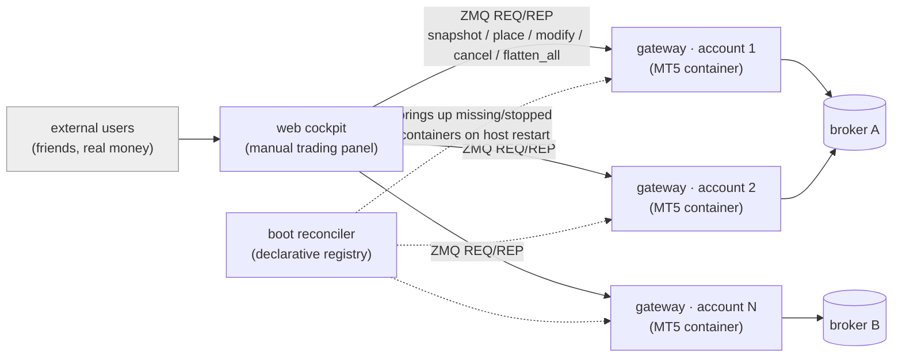

# HADIT Miami

**Status: RUNNING** — a multi-account MT5 trading service, on its own dedicated server, where external users (friends) trade real money today.

## What it is

Connect a broker. Trade manually from a web cockpit. Run multiple accounts. Copy-trade across them. That's the product — no framing beyond what it does.

Miami is the generalization of the family's own manual-trading cockpit (see [HADIT engine](../engine/)) into a standalone service: per-account MT5 terminals, containerized, fanned out over a ZeroMQ command surface, driven from one web panel. It is the "collapse point" half of HADIT's lineage doing its most literal job — turning a signal (a click, a drag) into an order, for people who are not the family.

## The isolation decision

External users' accounts do not live on the family's own infrastructure. HADIT's engine server runs the family's ~14 live strategies; Miami runs on a **separate, dedicated server** entirely — a deliberate boundary, not an afterthought. Someone else's money and someone else's credentials do not share a box, a container fleet, or a failure domain with the family's own capital. See [STORY.md](../../STORY.md) ("Hygiene is architecture") and [LINEAGE.md](../../LINEAGE.md) thread 1 ("their accounts could not live beside the family's own"). The architecture below enforces that separation structurally — Miami's fleet, gateway, and cockpit are a self-contained stack on their own host.

## Architecture (short version)

- **One MT5 image, N containers.** Each external account gets its own container: one Wine-hosted MT5 terminal, one `mt5_zmq_gateway.py` process speaking the official MetaTrader5 API locally and fanning it out over ZeroMQ. Isolation is per-container, per-process, per-socket.
- **Declarative terminal config.** Login credentials, server, and governor (algo-trading) state are written into an `mt5cfg.ini` before boot — no GUI automation, no click-driven login wizard.
- **Boot-time fleet reconciliation.** A reconciler (`reconcile_boot_fleet.py`) walks a declarative registry after every host/Docker restart and brings up whatever containers are missing or stopped, one at a time, memory-headroom-checked — the fleet self-heals to its declared state instead of trusting that everything came back up correctly.
- **One shared tick feed per broker**, not per account — exec gateways stay cheap (order/account only, no tick pull).
- **Web cockpit** (Python backend + HTML/JS panel) talks to each account's gateway over ZMQ REQ/REP: snapshot, place, modify (drag SL/TP), cancel, flatten-all/cancel-all, history.

## What's proven, not asserted

- Deterministic cold-boot of a 7-terminal, 2-broker fleet: all gateways up + both tick feeds streaming, measured (see EVIDENCE).
- Parallel order fan-out (place / cancel-all) across all 7 accounts: wall-clock ≈ slowest single account, not the sum.
- Replicable across brokers on the identical image — a new broker's accounts cold-boot, auto-login, auto-resolve the traded symbol, and serve with zero code change.

## Evidence index

| File | What it shows |
|---|---|
| [EVIDENCE/backend_debrief_excerpt.md](EVIDENCE/backend_debrief_excerpt.md) | Validated backend: 7 accounts / 2 brokers, native Linux Docker, measured cold-boot + fan-out numbers |
| [EVIDENCE/reconcile_boot_fleet_docstring.md](EVIDENCE/reconcile_boot_fleet_docstring.md) | Boot-time fleet reconciliation — the architecture headline, in its own words |
| [EVIDENCE/port_map_structure.md](EVIDENCE/port_map_structure.md) | Per-account service structure (ports redacted to `<port>`) |
| [EVIDENCE/git_log_hadit_mt5.md](EVIDENCE/git_log_hadit_mt5.md) | Active-development evidence — most recent commits, including a multi-account UI fix |
| [EVIDENCE/cross_pollination_amp_cockpit.md](EVIDENCE/cross_pollination_amp_cockpit.md) | The family's own family futures cockpit panel, ported from Miami's canonical cockpit panel |

## Snippets

| File | What it shows |
|---|---|
| [SNIPPETS/gateway_command_surface.py](SNIPPETS/gateway_command_surface.py) | The ZMQ command surface — the API shape one gateway exposes per account |
| [SNIPPETS/gen_mt5_config_declarative.py](SNIPPETS/gen_mt5_config_declarative.py) | Declarative MT5 startup-config generation — no GUI, no LLM in the loop |
| [SNIPPETS/reconcile_boot_fleet.py](SNIPPETS/reconcile_boot_fleet.py) | The fleet reconciler — boot-time self-healing of the per-account container set |

## Related

- [ARCHITECTURE.md](ARCHITECTURE.md) — fleet model, config generation, reconcile-at-boot, the family-infra/external-infra boundary.
- [DECISIONS.md](DECISIONS.md) — choices and rejected alternatives.
- [HADIT engine](../engine/) — the family's own execution engine; Miami is its cockpit generalized into a service.
- [LINEAGE.md](../../LINEAGE.md) thread 1 — where Miami sits in the trading-stack lineage.
