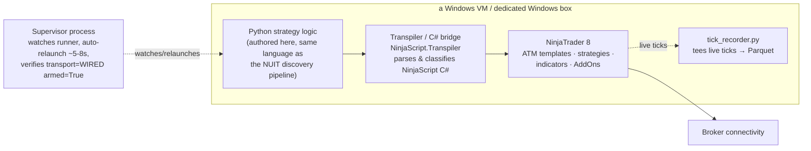

# Architecture — HADIT / NT8 Chicago (BUILT+RETIRED)

## Overview

Three layers, all on a single Windows box: a Python-authored strategy layer, a C#
transpiler/bridge layer, and NinjaTrader 8 itself as the execution/broker-connectivity
runtime. A supervisor process wrapped the whole thing, and (in the successor deployment)
a tick recorder tapped the live data path.

## The bridge

Strategy logic was authored on the Python side — the same language as the rest of the
research stack — then ported into NinjaScript C# so it could run inside NT8's native
execution model. The `NinjaScript.Transpiler/` tool that survives today is a Roslyn-based
classifier: it parses NinjaScript `.cs` source, detects whether a file is a Strategy,
Indicator, or AddOn by its base type, and enumerates its methods into a catalog
(`StrategyCatalog` / `StrategyFileInfo` / `ParameterInfo`). See
`SNIPPETS/transpiler-classifier.cs` for the verbatim mechanism.

This is the origin point of a problem that follows the whole HADIT lineage forward: once
the same logic exists in two languages, the two copies can drift. Nothing in the
Chicago-era tooling *proves* Python intent and C# behavior agree — that had to be done by
discipline (careful porting, manual review) rather than by an automated check. That gap
is exactly what the current engine's Time Travel Mirror and byte-identical build
certification (see `../engine/`) were built to close. The parity discipline was born from
living with this gap, not from reading about it.

## The production tree

A real NT8 user-data tree existed and was exercised: 21 custom strategies, 143 custom
indicators, 8 custom AddOns, 42 ATM order-management templates, 54 strategy templates,
and 563 strategy-analyzer log exports, with mtimes spanning mid-to-late May 2026. Daily
live tick tapes (CSV) exist for early-to-mid June 2026, including a `backfill_*` file —
evidence the recording pipeline needed to catch up a gap at least once, which only
happens to a system that is actually running. See `EVIDENCE/production-tree-counts.md`.

## The supervisor (successor deployment, HaditFugue)

The lineage's last NT8-era stand ran under a supervised-runner discipline documented in
`EVIDENCE/operational-discipline.md`:

- **Auto-relaunch:** the trading platform itself was never restarted — only the Python
  runner node — and a supervisor script relaunched it in roughly 5-8 seconds via a launch
  batch file on failure.
- **Post-restart verification ritual:** every restart was followed by checking
  `transport=WIRED armed=True` in the live log before trusting the new process, rather
  than assuming a successful relaunch meant a working one.
- **Armed-window restart guard:** restarts were withheld during an armed funded-leg
  window unless the trigger was far out-of-the-money — a hand-enforced version of the
  force-flat/armed-window guards that now exist formally in the Rust engine.
- **Multi-account routing:** a `multi_account_router.py` component routed across
  accounts.
- **Live tick recording:** an additive, env-gated `tick_recorder.py` teed the live trade
  tape to a local Parquet catalog (5000-tick / 60s flush cadence), added once the team
  noticed the tape was otherwise being discarded.

## Failure modes that drove retirement

None of these were catastrophic, one-time failures — they were the accumulating cost of
running production trading logic on a consumer GUI application:

1. **Crash/restart fragility.** NT8 and its host process were fragile enough that a
   supervised auto-relaunch loop was necessary infrastructure, not a nice-to-have. Every
   restart carried risk (hence the armed-window guard) and required a verification step
   the team could not skip.
2. **GUI-automation hazard.** A platform built around a Windows desktop application is
   inherently harder to run headless, harder to script safely, and harder to recover
   deterministically than an open, scriptable runtime.
3. **Two-language drift risk.** Every change to strategy logic had to survive a Python →
   C# port with no automated proof of equivalence. This is the risk the whole HADIT
   lineage's later verification culture (VERIFICATION.md, the Time Travel Mirror) exists
   to eliminate.
4. **Single-box operational ceiling.** Both the Chicago VM and the successor Windows box
   are gone. There was no path to scaling this design across more strategies or more
   accounts without multiplying all three problems above.

The move to Nautilus/Python (an open, scriptable oracle) and then to the Rust engine was
the direct response: keep the strategy-authoring language, remove the GUI-automated
runtime, and make language-parity a provable property instead of a hoped-for one.
