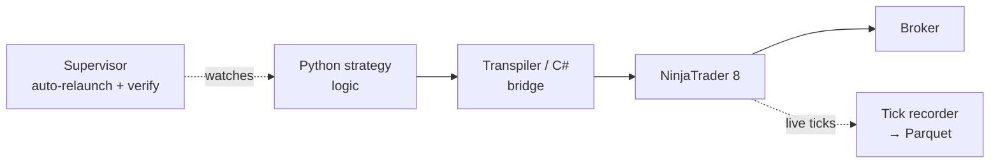

# HADIT / NT8 Chicago

**Status: BUILT+RETIRED**
**Part of:** HADIT — see [STORY.md](../../../STORY.md) · [LINEAGE.md](../../../LINEAGE.md)

This is the origin of the HADIT execution lineage: Python-authored strategy logic bridged
into NinjaTrader 8 through a C# layer, running on a Windows box, live-trading real
strategies. It traded — at scale: a preserved snapshot of the platform's own database,
recomputed in 2026, shows **978 live executions across 11 real prop-firm accounts (peak 10
concurrent in a single day) in one three-week window** for the two operators — and the
platform's rolling retention means lifetime volume exceeds what survives to be counted. It
was operated with real supervision discipline, and it was then **deliberately outgrown** —
in the operator's own words, "we evolved out of consumer-grade NT8/Windows." The Chicago VM is gone. The successor Windows deployment
(HaditFugue) that came after it is gone too. Nothing here is a claim that this system is
still running; it is a claim about where the rest of HADIT came from.

It is also where a discipline that now governs the live Rust engine was born: **when your
logic exists in two languages, you learn to prove they agree.** Here the two languages
were Python and C#. Today they are Python (the Nautilus oracle) and Rust — and the engine
is certified byte-for-byte against that oracle before anything ships (see
`../engine/`, `VERIFICATION.md`). The habit started here, out of necessity, not doctrine.

## What's proven here

| Claim | Evidence |
|---|---|
| It traded — a real NT8 production tree existed and was used | [`EVIDENCE/production-tree-counts.md`](EVIDENCE/production-tree-counts.md) — 21 strategies, 143 indicators, 8 AddOns, 42 ATM templates, 563 analyzer-log exports, mirrored on a second machine |
| It recorded live data | same file — daily tick tapes, including a `backfill_*` file (evidence the pipeline needed to catch up a gap) |
| The bridge design: Python → C# → NT8, and its surviving descendant | [`EVIDENCE/transpiler-repo-history.md`](EVIDENCE/transpiler-repo-history.md), [`SNIPPETS/transpiler-classifier.cs`](SNIPPETS/transpiler-classifier.cs) |
| Real operational maturity, not just "it ran" | [`EVIDENCE/operational-discipline.md`](EVIDENCE/operational-discipline.md) — supervised auto-relaunch, post-restart verification ritual, armed-window restart guard, multi-account routing, live tick recording |
| Artifacts were deliberately preserved, not lost with the box | [`EVIDENCE/chicago-exports-inventory.md`](EVIDENCE/chicago-exports-inventory.md) |
| The design tradeoffs, stated with the rejected alternative | [`DECISIONS.md`](DECISIONS.md) |
| The architecture, and the failure modes that actually drove retirement | [`ARCHITECTURE.md`](ARCHITECTURE.md) |

## Why retired

Not a failure — a ceiling. Consumer-grade NT8/Windows meant crash/restart fragility (a
supervisor and a verification ritual became mandatory infrastructure), GUI-automation
hazards (harder to run headless, harder to recover deterministically), and unproven
two-language drift risk (every strategy change was a Python → C# port with no automated
proof the two sides agreed). The team's own restart-safety rules and manual verification
steps — see `EVIDENCE/operational-discipline.md` — are the paper trail of a team managing
a platform's limits carefully, right up until managing it further stopped being worth it.
The response was architectural, not incremental: move the strategy-authoring language
forward (Nautilus/Python, then Rust), and make cross-language agreement something you can
prove, not something you hope for. See `../engine/` for what that became.

## Redactions

No account IDs, broker names, hostnames/IPs (referred to generically as "a Windows VM" /
"a dedicated Windows box"), strategy names, strategy rules, symbol+rule combinations, or
P&L appear anywhere in this directory. Every file under `EVIDENCE/` states its own
redactions at the top. One source document encountered during research
(`<retired-credentials note — vaulted separately>`) was found to contain live plaintext credentials rather than
pipeline documentation; it was not read past its first lines and is not reproduced or
referenced beyond the note in `EVIDENCE/chicago-exports-inventory.md`.
