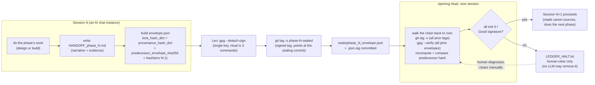

# Build Method + Crypto Governance

**Status:** BUILT+DORMANT (proven, parked 2026-04-28)
**Part of:** NUIT — see [STORY.md](../../STORY.md)

How do you trust a build that was produced across a dozen separate AI chat sessions, months apart,
each one starting from zero memory of the last? The answer built here: every session boundary gets
sealed like a git release — hash-chained, GPG-signed, human-verified before the next session is
allowed to read the substrate. Layered under it, a **mortal-architect protocol**: no single AI
context runs the whole project. Architects (Master Architect I through XIII, so far) stand down
when their bandwidth degrades, hand off in writing, and never talk to each other directly — the
sealed record is the only channel between them.

This ran for real, once, on the NUIT Spectral Minesweeper design-and-build cycle: **8 sealed
envelopes**, an unbroken **8-link predecessor hash chain** rooted at the protocol document itself,
and a **single GPG key** whose signature was manually re-verified at the opening of every
subsequent phase (documented "Good signature" / `exit=0` transcripts survive for each). It was
proven, then deliberately parked — the project it protected reached a natural pause, and the
governance discipline had nothing left to seal. Stated plainly, because the honest gaps are what
make the rest credible: the automated verifier this protocol specifies (`handoff_verifier.py`) was
**never built** — every verification that happened, happened by a human running the `git tag -v` /
`gpg --verify` commands by hand and reading "Good signature." And only one signing key (Leo's) was
ever actually used, never the multi-key rotation the design allows for.

## How it works

The mechanism actually runs at three stacked layers: **Layer 1** (content hashing — every design
"lock" and every input file gets a SHA-256 under a byte-deterministic canonicalization, CJS-v1),
**Layer 2** (a signed git tag anchors the envelope to a specific commit), **Layer 3** (a detached
GPG signature over the envelope). A verifier is supposed to check all three and only then let the
next session read the substrate — that automated verifier is the one part of this that was
designed in full (`HANDOFF_CRYPTO_PROTOCOL.md` §9) and never coded; the checking that actually
happened was the human running the equivalent commands by hand, every phase, and reading the
output.

## What's proven here

| Claim | Evidence |
|---|---|
| 8 sealed envelope/signature pairs on disk (17 files incl. the public key) — file inventory | [`EVIDENCE/seals_inventory.md`](EVIDENCE/seals_inventory.md) |
| Manual GPG verification actually ran, phase after phase — real "Good signature" / `exit=0` transcripts | [`EVIDENCE/gpg_verification_transcript.md`](EVIDENCE/gpg_verification_transcript.md) |
| The predecessor hash chain, root to tip, including the one deliberate branch (rebind, not overwrite) | [`EVIDENCE/hash_chain_provenance.md`](EVIDENCE/hash_chain_provenance.md) |
| Mortal-architect succession: Architect XI stand-down → XII → XIII spawn, in the architects' own words | [`EVIDENCE/mortal_architect_succession.md`](EVIDENCE/mortal_architect_succession.md) |
| Honest status: what's proven, what's spec-only, what never got built, and why it was parked | [`EVIDENCE/honest_status_and_gaps.md`](EVIDENCE/honest_status_and_gaps.md) |
| Envelope schema, CJS-v1 canonicalization spec, receipt hash-chain-link code | [`SNIPPETS/`](SNIPPETS/) |
| Mechanism detail: envelope format, three layers, halt gate, architect succession, the never-built verifier | [`ARCHITECTURE.md`](ARCHITECTURE.md) |
| Decisions + rejected alternatives | [`DECISIONS.md`](DECISIONS.md) |

*Identifiers, credentials, and any strategy-adjacent content in receipts are redacted throughout;
every `EVIDENCE/` file states what was redacted and why at its top. Only Leo's public GPG key
material is referenced — no private key touches this repo.*

## What this is, honestly

This is a **convergent-validated design layer**, not novel cryptography — every primitive (SHA-256,
GPG detached signatures, signed git tags, hash chains) is stock and cited in the protocol document
itself. Prior art for "cryptographically audit AI agent actions" exists (e.g. `ai-audit-trail`-style
tooling). What's distinctive here is narrower and more specific: **crypto admission-gating across
the LLM dev-session boundary itself** — a fresh AI session is not allowed to trust the substrate it
inherits until a human-run verification chain says it can — combined with the **mortal-architect
protocol**, which is a governance convention, not a cryptographic one. The existence proof is the
point: this ran, on a real build, eight times in a row, without a break in the chain.
