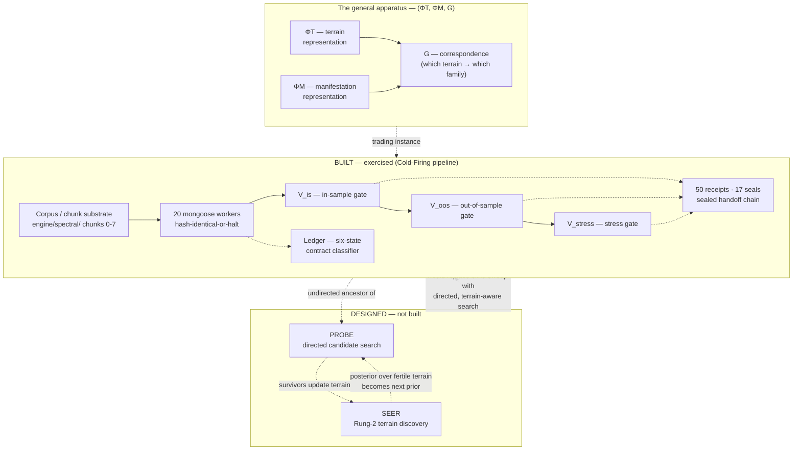

# Spectral Minesweeper

**Part of NUIT** — see [../../../STORY.md](../../../STORY.md) § "NUIT began as
a discovery system." For the intellectual history behind this project's
status labels below (v2 → v3 → v4, including the category error caught and
corrected), see [../../../LINEAGE.md](../../../LINEAGE.md) § 2 — not repeated
here.

| Component | Status |
|---|---|
| Cold-Firing candidate generation + V-chain (V_is → V_oos → V_stress) | **BUILT — exercised** (verdicts on disk, dated 2026-05-11) |
| Mongoose determinism contract (20 deterministic workers) | **BUILT — exercised** |
| Ledger six-state contract classifier | **BUILT — exercised** |
| Sealed handoff discipline (50 receipts, 17 seals) | **BUILT — exercised** |
| SEER (terrain discovery) | **DESIGNED**, not built |
| PROBE (directed candidate search) | **DESIGNED** in its general form; Cold-Firing is its primitive, undirected ancestor |
| General apparatus `(ΦT, ΦM, G)` | **mid-build**, stated plainly |

## What this is, and why

Spectral Minesweeper is a discovery methodology for finding a latent
generative *terrain* from the geometry of observed outcomes, rather than
starting from predefined variables. Trading is its proving ground — chosen
deliberately, because manifestations (candidate strategies) are cheap to
manufacture and outcomes are cheap and fast to evaluate, so the apparatus can
be validated somewhere failures cost money rather than people (see
`DECISIONS.md` #6). What actually ran here is **Cold-Firing**: a
Sobol-style candidate sweep pushed through a three-gate validation chain
(V_is → V_oos → V_stress), backed by a determinism contract on every worker
and a cryptographically receipted handoff trail. What was *designed but not
built* is the general apparatus this pipeline is a primitive instance of —
stated honestly rather than implied by proximity to working code.

## The general form (from the canonical blueprint)

> "Spectral is an apparatus for discovering the latent generative terrains
> from which a family of phenomena tends to emerge — inferring both the
> representation of terrain and the family of manifestations, and the
> correspondence between them, from the geometry of observed outcomes rather
> than from predefined variables."

The apparatus operates over a triple `(ΦT, ΦM, G)` — terrain representation,
manifestation representation, and the correspondence between them — evaluated
against a **Rung taxonomy** (Rung 0: predict an observed thing; Rung 1:
predict a derived manifestation; Rung 2: discover the latent coordinate that
generates many manifestations). SEER is the Rung-2/ΦT-discovery half; PROBE is
the Rung-0/1 exploitation half. Per the blueprint's own accounting:

> "PROBE without SEER is blind search (this is what Sobol cold-firing was —
> expensive, undirected...). SEER without PROBE is terrain-characterization
> with no exploitation. The apparatus requires both."

That is the honest mid-build framing this project states plainly: the
Cold-Firing build that ran was good, disciplined engineering work — it is
also, by the apparatus's own later self-correction, PROBE running without its
SEER half yet existing. See `ARCHITECTURE.md` § 6 for what SEER/PROBE would
add.

## Diagram

Solid arrows: exercised, on disk. Dashed arrows: designed relationships, not
yet executing.

## Evidence index

- `EVIDENCE/v_chain_verdicts_structure.md` — V_is/V_oos/V_stress field names,
  row counts, dates (2026-05-11), values redacted
- `EVIDENCE/mongoose_worker_inventory.md` — the 20 deterministic worker
  modules + idempotency contract
- `EVIDENCE/chunk_stage_substrate.md` — chunk 0-7 substrate as named stages
- `EVIDENCE/receipts_and_seals.md` — 50 receipts (sample filenames), 17 seals
  (count only)
- `EVIDENCE/alchemical_stage_vocabulary.md` — stage-name vocabulary as
  discipline, not mysticism
- `EVIDENCE/handoff_crypto_protocol_excerpt.md` — protocol head + cross-link
  to `kubera/nuit/build-method-governance/`
- `SNIPPETS/idempotency_check.py` — the dispatch-twice-and-compare code
- `SNIPPETS/contract_state_classifier.py` — the ledger's six-state enum +
  role matcher
- `SNIPPETS/verdict_row_structure.jsonl` — verdict row shapes, values redacted
- `ARCHITECTURE.md` — full system layout, what's withheld and why
- `DECISIONS.md` — 9 decisions with the rejected alternative for each

## What's withheld

`FORMULA_LIBRARY/` is never opened or listed — a formula library exists and is
withheld. Gate thresholds, strategy parameters, corpus grammar, and
symbol+rule combinations are trade secret throughout. No P&L figures appear
anywhere in this project. Candidate and leg identifiers are replaced with
opaque tokens. Full accounting in `ARCHITECTURE.md` § 6.
