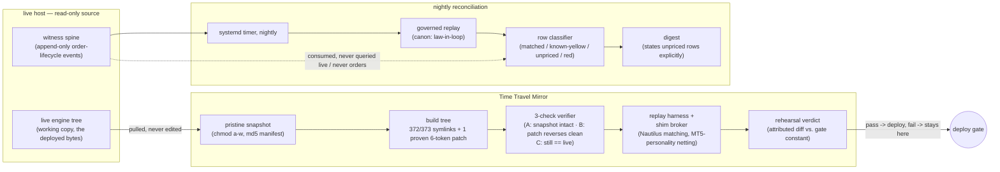

# Time Travel Mirror

**Status:** mirror — **BUILT** (exercised) · nightly reconciliation — **RUNNING**
**Part of:** NUIT — see [STORY.md](../../STORY.md)

Two roles, one system. First: a **deploy-rehearsal mirror** — the backtest harness compiles
against the live engine's own bytes (372 of 373 engine-tree files are symlinks into a read-only
copy of the live tree; the one remaining file is mechanically proven, every build, to differ by
exactly six `pub` tokens), so a change is run and observed here before it ever touches live
capital. Second: the **nightly reconciler** — the same lineage of tooling runs after every trading
day, prices what the live engine actually did against what the governed replay says should have
happened, and pushes a digest that states plainly when a row could not be priced rather than
folding it into a total. Same discipline, two cadences: rehearse-before-deploy, and
verify-after-the-fact.

Built 2026-07-25, the live host read-only throughout. Formal acceptance ran 2026-07-23/24 (8 runs, a real
shim broker with Nautilus-matching + MT5-personality netting, every ledger diff attributed,
isolation PASS / zero unscoped writes). The nightly reconciler has been running since, off a
systemd timer.

## Why it exists

Leo, on the mirror this replaced (a fork of the engine, taken at an unrecorded moment and drifted
since — nothing in the old system could notice):

> "The Rust engine at Time Travel is NOT a copy-paste of the live engine plus prism, gold law, MES
> law. And it should be." … "Time travel should be a MIRROR of the engine. Any change we deploy, we
> deploy it in time travel first, run it, see the result, and then if we like the result we deploy
> it on the live engine."

## How it fits together

## What's proven here

| Claim | Evidence |
|---|---|
| Byte-identity: 372/373 symlinked, 1 file mechanically proven to differ by 6 `pub` tokens only | [`EVIDENCE/symlink_proof.md`](EVIDENCE/symlink_proof.md) |
| Doctrine (rehearse first) + the live host read-only throughout the build | [`EVIDENCE/doctrine_and_readonly.md`](EVIDENCE/doctrine_and_readonly.md) |
| Reproduction proof: mirror output byte-identical to the forked harness across 4 cells | [`EVIDENCE/reproduction_proof.md`](EVIDENCE/reproduction_proof.md) |
| Formal acceptance: 8 runs, era-exact binaries, real shim broker, attributed diff, isolation PASS | [`EVIDENCE/acceptance_summary.md`](EVIDENCE/acceptance_summary.md) |
| Nightly reconciliation cadence: systemd timer → run_daily → verdict → digest | [`EVIDENCE/recon_timer.md`](EVIDENCE/recon_timer.md) |
| Digest states unpriced rows explicitly instead of silent partial sums | [`EVIDENCE/unpriced_rows_honesty.md`](EVIDENCE/unpriced_rows_honesty.md) |
| Provenance-check mechanism, attribution shape, row-classifier legend | [`SNIPPETS/`](SNIPPETS/) |
| Decisions + rejected alternatives | [`DECISIONS.md`](DECISIONS.md) |
| Mechanism detail: symlink layer, shim broker, acceptance harness, recon pipeline, boundaries | [`ARCHITECTURE.md`](ARCHITECTURE.md) |

*Identifiers, credentials, strategy parameters, and P&L figures are redacted throughout; every
`EVIDENCE/` file states what was redacted and why at its top.*
