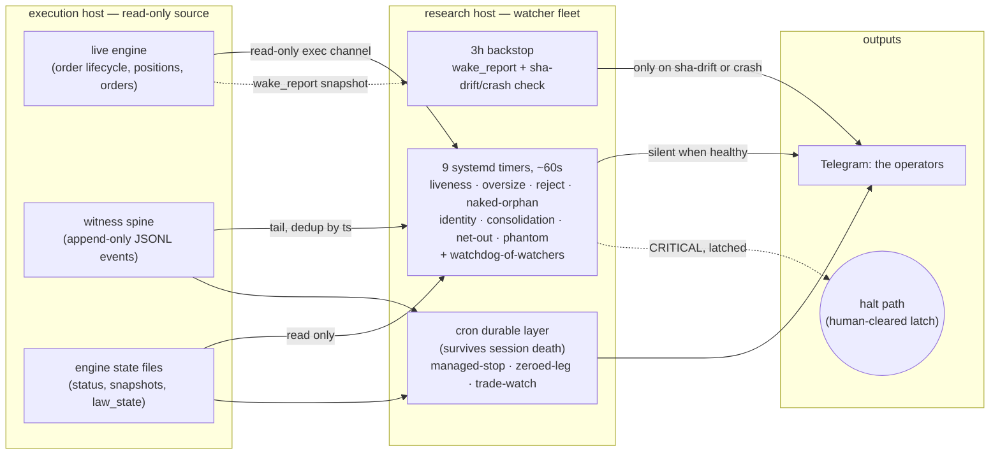

# NUIT watchers

**Status:** RUNNING
**Part of:** NUIT — see [STORY.md](../../../STORY.md)

An independent supervision fleet that watches the live trading engine from a separate host —
nine systemd timers firing roughly every 60 seconds, a cron layer that survives session death,
and a 3-hour backstop that phones home even if everything else on the research host dies. Each
watcher covers one failure class — engine liveness, oversized positions, phantom orders, naked
positions, account-identity drift, netting consolidation, net-out events, managed-stop
regressions, zeroed-leg bypasses. None of it authors a trade, sizes a position, or sends an
order verb: every script in the fleet reads state (via a read-only exec channel, witness logs,
or state files) and either stays silent or telegrams the operators. The one thing this fleet is
permitted to *do*, beyond alert, is trigger a halt path — it cannot originate a candidate or a
fill.

This project is the **real-time / near-real-time** layer. It is deliberately separate from the
[Time Travel Mirror](../time-travel-mirror/), which owns deploy rehearsal and **nightly**
batch reconciliation (canon-vs-live, priced from venue records, once per trading day). The
watcher fleet has no opinion on whether yesterday's fills matched the model — it only asks
"is the engine alive, sane, and not carrying an unprotected or unattributed position right
now." Where the two meet: `consolidation_watcher.py` also meta-watches the separate
equity-watchdog process's heartbeat, and `ramp_watcher.py` (nightly, not part of the 60s fleet)
consumes the Mirror's recon verdicts to produce promote recommendations for a human to act on —
it never trades.

**The watchers cannot author.** Every read path in this fleet uses read-only verbs against the
execution host (a read-only exec channel, witness-log tailing, state-file reads); grep across
the fleet's source turns up zero order-placement, order-modification, or order-cancellation
calls. The only actions available to a watcher are: send a Telegram message, write to a local
alert log, and — for the one component authorized to intervene, the equity watchdog — flatten
or halt and latch, with the latch cleared only by a human.

## What's proven here

| Claim | Evidence |
|---|---|
| 9 systemd watcher timers firing ~every 60s, live today (+ 7 more timers on the same host for adjacent, non-watcher automation — see below) | [`EVIDENCE/timer_table.md`](EVIDENCE/timer_table.md) |
| Cron durable layer + 3h backstop, re-armed and running | [`EVIDENCE/cron_durable_layer.md`](EVIDENCE/cron_durable_layer.md) |
| Defense-in-depth: one watcher per failure class | [`EVIDENCE/failure_class_matrix.md`](EVIDENCE/failure_class_matrix.md) |
| Structural boundary: read-only against the execution host, zero order verbs | [`EVIDENCE/readonly_boundary.md`](EVIDENCE/readonly_boundary.md) |
| Iteration-under-fire: dated `.pre_*` snapshots across the fleet | [`EVIDENCE/pre_snapshot_discipline.md`](EVIDENCE/pre_snapshot_discipline.md) |
| Running evidence: dated backstop/wake archives | [`EVIDENCE/running_archives.md`](EVIDENCE/running_archives.md) |
| Latch/alert pattern, read-only consumption pattern, silent-when-healthy gate | [`SNIPPETS/`](SNIPPETS/) |
| Decisions + rejected alternatives | [`DECISIONS.md`](DECISIONS.md) |
| Mechanism detail: three layers, boundary, failure modes of the watchers themselves | [`ARCHITECTURE.md`](ARCHITECTURE.md) |

*Identifiers, credentials, hostnames, chat recipients, strategy leg names, commit shas, and P&L
are redacted throughout; every `EVIDENCE/` file states what was redacted and why at its top.*

## The full automation picture on this host

This project scopes to the 9 failure-class watchers by design (each is a distinct alert/halt
detector; bundling unrelated jobs into "the watcher fleet" would blur that boundary). The research
host runs **20 distinct scheduled units total** (16 systemd timers + 4 cron lines), verified by
direct count. The other 7 timers are real, live, and NOT part of this fleet's alert/halt design —
they belong elsewhere in this repo or are further automation surface not yet its own evidence
entry: `rust-recon-daily` and `timetravel-registry` → [Time Travel Mirror](../time-travel-mirror/);
`q90-tg-poller`, `regime-daily`, `forward-parity`, `delta-spirit` → research/signal tooling
adjacent to [Spectral Minesweeper](../spectral-minesweeper/), not independently evidenced here.
Stated plainly rather than folded into a bigger "watcher" number that would overstate what each
one actually does.
